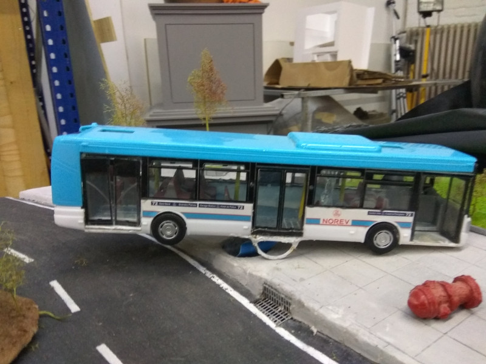

# BusPivot
An Arduino based tsukubai fountain like art installation, called the bus pivot. A modell bus is on a pivot and flooded with water by an aquarium pump. When the bus tilts, the bus door is opened by a servo and the water will run out of the bus. When the water has been spuilled out, the bus tips back and the door is closed.

## History 

* V1.0 2019-05-25 v1.0 initial release using 1 servo for open the door and an MPU6050 IMU for tilt detection 
* V2.0 2019-11-23 v2.0 using 1 servo and 1 push button to detect the tilt
* V2.1 2020-05-18 v2.1 using a second servo for push back the bus, when not tilting
